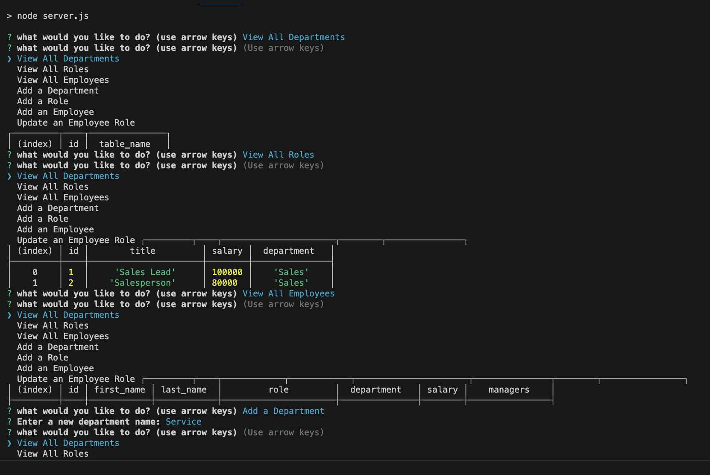
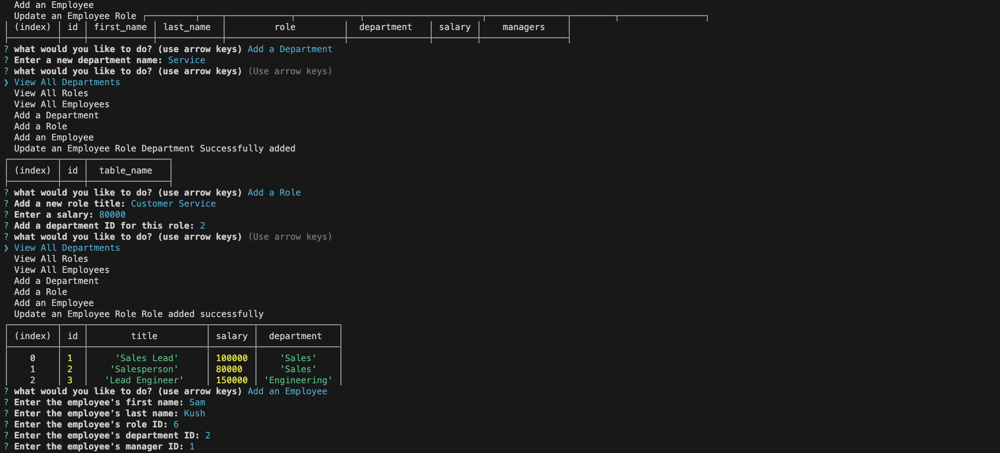

# Employee-Tracker

## Description

I built this project for all the managers out there: project managers, company managers, CEO's. With this application it makes it easy to say organized and keep all your employees associated with the correct groups. This application gives all information on the position of the employee, keeping everything in one place. While building this application I learned how to seed data properly through MYSQL workbench and create a database. 

## Table of Contents (Optional)

If your README is long, add a table of contents to make it easy for users to find what they need.

- [Installation](#installation)
- [Usage](#usage)
- [Credits](#credits)
- [License](#license)

## Installation

To run this application you will need to install: mysql2 and inquirer 8.2.4

## Usage

To use the application you want to again, install the packages I listed previously above and the run either: npm start or node server.js in the command line terminal. You want to see if "npm start" is in your package.json file where it says "scripts", if it is not in there reinstall inquirer. Once all is done and you run either command in the CLI then you will prompted with a list of categories to view/add to if you would like.

Here is a video of the application being used: https://drive.google.com/file/d/10_Cndx-eDbwCbysvfJoTbIhDqW6X1eHH/view

## Credits

- create tables(https://www.youtube.com/watch?v=F8w3w9_9Cog)
- debugg mysql server problems(https://phoenixnap.com/kb/start-mysql-server)
- env install(https://www.npmjs.com/package/dotenv)
- mysql2 install(https://www.npmjs.com/package/mysql2)
- the help from "jcasusi" on ask bcs

## License

Refer to documentation in repo: https://mit-license.org/

## How to Contribute

 The [Contributor Covenant](https://www.contributor-covenant.org/) is an industry standard
